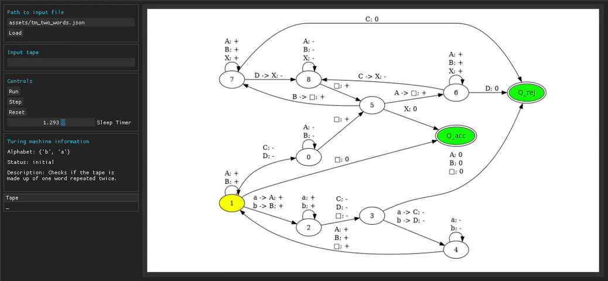

# Turing Point

Project for my SKJ course.

## Description

This project is a tool for visual simulation of turing machines.

There are two example machines in the `assets` folder ready to load. You can create your own ones assuming you follow the conventions illustrated in the machines provided.

In the program itself, you can load a turing machine and see it work through a tape. The program allows custom tape specification, it has functionality to run the machine (with the option of changing sleep time between steps), step through it manually and reset it.

## Build

All requirements are specified in the `requirements.txt` file, install them with `pip install -r requirements.txt`. Run the program with `python main.py`.

## Known Bugs

- Resizing. I tried my very best to keep the image at it's specified dimensions, but I have no idea what I'm doing and wasn't able to fix it.
- Inputting an invalid character into the tape input. This is not allowed and will result in recreation of the whole input field, because just setting its text leads to an endless callback loop. This means that the window will lose focus, which is very annoying.
